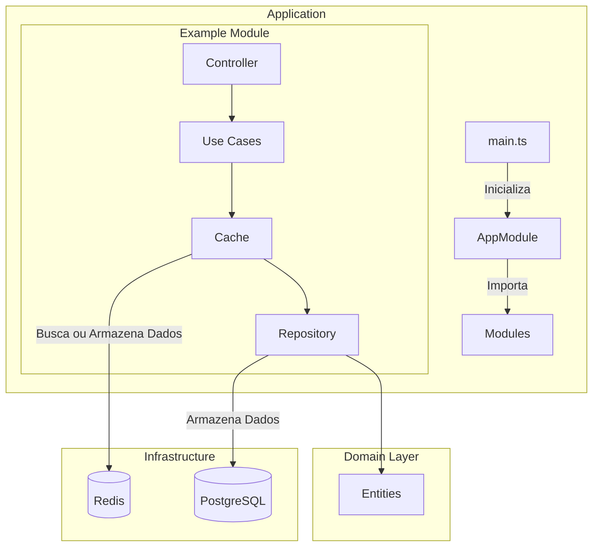

# Agriculture API

## Visão Geral

A **Agriculture API** é uma aplicação modular de backend projetada para gerenciar produtores e fazendas, seguindo os princípios de Domain-Driven Design (DDD). Desenvolvida com NestJS, TypeORM e Redis, a aplicação é escalável, performática e fácil de manter.

---

## Conceitos-Chave

- **Domain-Driven Design (DDD)**: Arquitetura orientada a domínio, separando lógica de negócios, aplicação e infraestrutura.
- **NestJS**: Framework robusto para construção de APIs escaláveis e modulares.
- **TypeORM**: Mapeamento Objeto-Relacional (ORM) para facilitar interações com o banco de dados.
- **Redis**: Utilizado como cache para maior eficiência em acessos repetitivos.

---

## Estrutura de Pastas

```plaintext
src/
├── app.module.ts
├── config/
├── core/
├── migrations/
├── modules/
│   ├── farms/
│   └── producers/
└── main.ts
```

---

## Diagrama de Arquitetura



---

## Como Instalar e Usar

### Pré-requisitos

- Node.js (v18 ou superior)
- Docker e Docker Compose

### Instalação

1. Clone o repositório:
   ```bash
   git clone https://github.com/prdossantos/agriculture-api.git
   cd agriculture-api
   ```

2. Execute o Makefile:
   ```bash
   make setup
   ```

### Uso

1. Inicie o ambiente de desenvolvimento:
   ```bash
   npm run start:dev
   ```

2. Acesse a API em:
   ```
   http://localhost:3000
   ```

3. Para executar os testes:
   ```bash
   npm test
   ```

4. Para ver a documentação:
   ```bash
   http://localhost:3000/docs
   ```
   ou importe o json no seu postman http://localhost:3000/openapi.json

---

## Itens Faltantes

### Funcionalidades

1. **Permitir o registro de várias culturas plantadas por fazenda do produtor.**
   - Cada fazenda deve poder registrar múltiplas culturas associadas a diferentes safras.

2. **Um produtor pode estar associado a 0, 1 ou mais propriedades rurais.**
   - Garantir que o relacionamento entre produtor e fazendas seja implementado corretamente.

3. **Uma propriedade rural pode ter 0, 1 ou mais culturas plantadas por safra.**
   - Adicionar suporte para associar múltiplas culturas a uma safra específica.

4. **Exibir um dashboard com:**
   - **Total de fazendas cadastradas (quantidade).**
   - **Total de hectares registrados (área total).**
   - **Gráficos de pizza:**
     - Por estado.
     - Por cultura plantada.
     - Por uso do solo (área agricultável e vegetação).

### Infraestrutura

5. **Aplicação do cache para consultas.**
   - Implementar cache em consultas frequentemente acessadas para melhorar a performance.
   - Permitir habilitar/desabilitar o cache via configuração.

---

## Melhorias Futuras

### Escalabilidade

1. **Filas com RabbitMQ ou Kafka:**
   - **Exemplo:** Processar notificações de alterações de dados para gerar relatórios.
   - **Motivo:** Processamento assíncrono melhora o desempenho e desacopla serviços.

2. **Migração para microsserviços:**
   - **Exemplo:** Criar um serviço independente para gerenciar produtores.
   - **Motivo:** Permite maior escalabilidade e resiliência ao dividir responsabilidades.

3. **Balanceamento de carga:**
   - **Exemplo:** Usar Nginx para distribuir requisições entre múltiplas instâncias.
   - **Motivo:** Aumenta a disponibilidade e performance do sistema.

### Manutenção

1. **Monitoramento e observabilidade:**
   - **Exemplo:** Configurar Grafana para visualizar métricas de uso de memória e tempo de resposta.
   - **Motivo:** Ajuda a identificar gargalos e melhorar a confiabilidade.

2. **Cobertura de testes:**
   - **Exemplo:** Adicionar testes end-to-end para verificar fluxos completos.
   - **Motivo:** Garante a qualidade do código e reduz riscos de regressões.

3. **Documentação automatizada:**
   - **Exemplo:** Usar ferramentas como Redoc para gerar documentação visual da API.
   - **Motivo:** Facilita o entendimento da API para novos desenvolvedores e clientes.

### Performance

1. **Otimização de consultas SQL:**
   - **Exemplo:** Revisar índices no banco de dados para acelerar buscas frequentes.
   - **Motivo:** Reduz o tempo de resposta e melhora a experiência do usuário.

2. **Cache distribuído:**
   - **Exemplo:** Usar Redis Cluster para armazenar resultados de consultas grandes.
   - **Motivo:** Garante alta disponibilidade e velocidade no acesso ao cache.

3. **Implementação de GraphQL:**
   - **Exemplo:** Permitir ao cliente consultar apenas os campos necessários para uma operação específica.
   - **Motivo:** Reduz a sobrecarga de dados e aumenta a flexibilidade nas requisições.

Com essas melhorias, a aplicação se tornará ainda mais robusta, escalável e eficiente. 🚀
